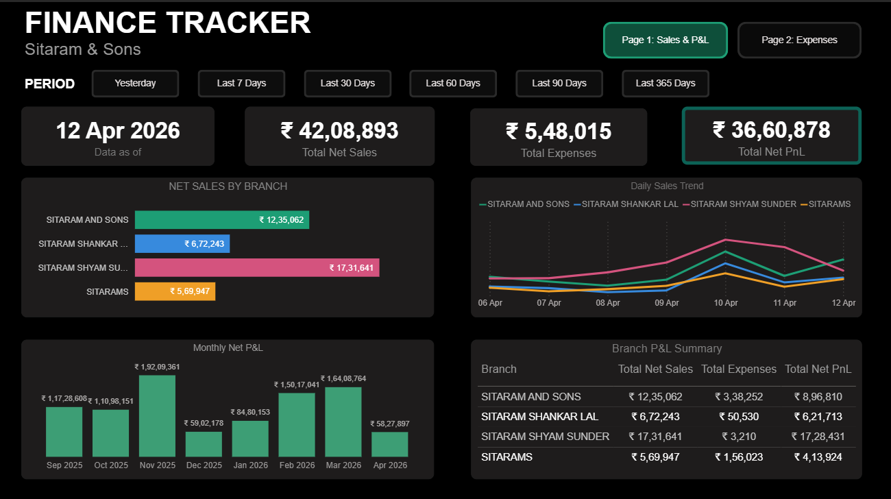
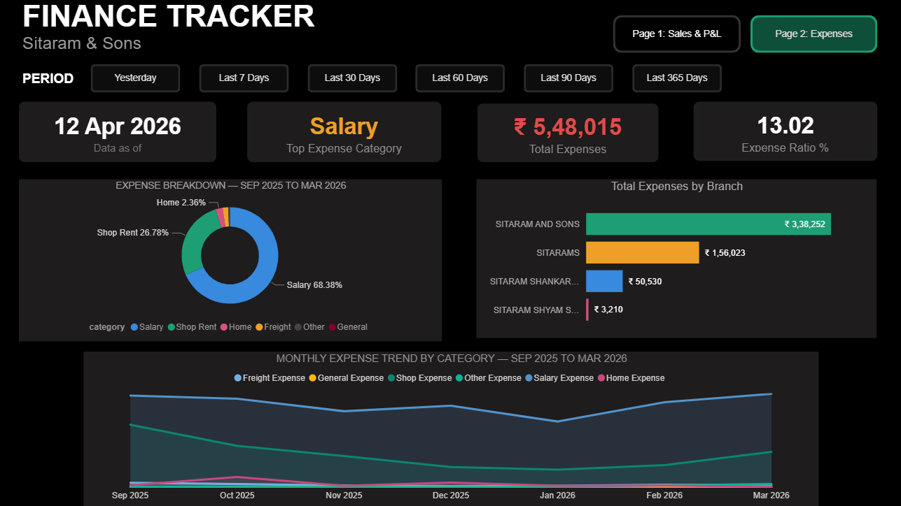

# Sitaram & Sons — Stock & Finance Analytics Pipeline


> End-to-end ELT pipeline and business intelligence dashboard for a live clothing retail business — Sitaram & Sons, Patna.  
> Built to surface ₹7.5 Crore in stagnant inventory and analyse ₹11.16 Crore in sales across 4 retail branches.

---

## Dashboard Preview

### Page 1 — Sales & P&L



### Page 2 — Expense Tracker



---

## Project Overview

Sitaram & Sons is a clothing retail business operating through a Head Office and 4 active branches. The Head Office receives all stock from suppliers and distributes to branches. The business uses QuickBill billing software which exports raw data as CSV and Excel files.

This project builds a complete analytics pipeline from raw billing exports to an interactive Power BI dashboard — covering sales performance, P&L, expense tracking, inventory health, and supplier analysis.

**This is real business data — not a tutorial dataset.**

---

## Tech Stack

| Layer          | Tool             | Purpose                             |
| -------------- | ---------------- | ----------------------------------- |
| Extract + Load | Python (Pandas)  | Clean raw files, upload to BigQuery |
| Storage        | Google BigQuery  | Cloud data warehouse (free tier)    |
| Transform      | dbt Core         | SQL transformation layer            |
| Visualise      | Power BI Desktop | Interactive dashboards              |

**Pipeline:** `Raw CSV/Excel → Python → BigQuery (raw) → dbt → BigQuery (mart) → Power BI`

---

## Architecture

```
QuickBill Exports (CSV / Excel)
        │
        ▼
Python + Pandas
  - Type casting
  - Deduplication
  - Null handling
  - Upload to BigQuery
        │
        ▼
BigQuery — raw dataset
  - purchase, sales, sales_returns
  - ledger, stock_balance, stock_movement
  - stockout, dead_stock, daily_sales_live
        │
        ▼
dbt Core — 20 models
  - Staging (views)     → 8 models
  - Intermediate (views)→ 5 models
  - Mart (tables)       → 7 models
        │
        ▼
Power BI Desktop
  - Finance Tracker (Pages 1 & 2)
  - Stock Tracker (Pages 3)
```

---

## Repository Structure

```
sitaram-inventory/
│
├── clean_data/
│   ├── clean_sales.py
│   ├── clean_purchase.py
│   ├── clean_ledger.py
│   ├── clean_stock_balance.py
│   ├── clean_stock_movement.py
│   └── upload_to_bigquery.py
│
├── dbt_project/
│   ├── models/
│   │   ├── staging/
│   │   │   ├── stg_sales.sql
|   |   |   ├── stg_dead_stock.sql
│   │   │   ├── stg_purchase.sql
│   │   │   ├── stg_ledger.sql
│   │   │   ├── stg_stock_balance.sql
│   │   │   ├── stg_stock_movement.sql
│   │   │   ├── stg_sales_returns.sql
│   │   │   ├── stg_stockouts.sql
│   │   │   └── stg_healthy_items.sql
│   │   ├── intermediate/
│   │   │   ├── int_inventory_velocity.sql
│   │   │   ├── int_net_sales.sql
│   │   │   ├── int_product_performance.sql
│   │   │   ├── int_daily_pnl.sql
│   │   │   └── int_transfer_opportunities.sql
│   │   └── final/
│   │       ├── mart_financials.sql
│   │       ├── mart_branch_performance.sql
│   │       ├── mart_action_board.sql
│   │       ├── mart_supplier_analysis.sql
│   │       ├── mart_procurement_analysis.sql
│   │       └── mart_product_brand_performance.sql
│   ├── dbt_project.yml
│   └── schema.yml
│
├── assets/
│   ├── page1_sales_pnl.png
│   └── page2_expenses.png
│
└── README.md
```

---

## Raw Data Sources (BigQuery — `raw` dataset)

| Table              | Source File                                   | Description                                  |
| ------------------ | --------------------------------------------- | -------------------------------------------- |
| `purchase`         | purchase_report.xlsx                          | Every purchase at HO level                   |
| `sales`            | inventory_transaction_sales_report.csv        | Every item sold across all branches          |
| `sales_returns`    | inventory_transaction_report_sales_return.csv | Every item returned                          |
| `ledger`           | daybook_ledger.csv                            | All financial vouchers                       |
| `stock_balance`    | stockbalancereport.csv                        | Current stock on hand per SKU per branch     |
| `stock_movement`   | stockmovementreport.csv                       | Full movement history                        |
| `stockout`         | stockout.xlsx                                 | Items that sold and are now out of stock     |
| `daily_sales_live` | GitHub Actions (automated)                    | Live daily sales — grows daily from Apr 2026 |

---

## dbt Models — 21 Models

**Materialisation strategy:** staging → `view`, intermediate → `view`, mart → `table`

### Staging Layer (9 models)

Cleans and standardises raw tables. Key transformation: `stg_sales` removes 1,592 duplicate rows using `ROW_NUMBER()` deduplication.

### Intermediate Layer (5 models)

Business logic layer — calculates velocity, net sales, product performance, daily P&L, and transfer opportunities between branches.

### Mart Layer (7 models — Power BI reads these)

| Model                            | Rows   | Description                                     |
| -------------------------------- | ------ | ----------------------------------------------- |
| `mart_financials`                | 1,400  | Daily branch P&L — Aug 2025 to Mar 2026         |
| `mart_action_board`              | 60,200 | Every SKU at every branch with action tag       |
| `mart_branch_performance`        | 5      | Branch comparison with revenue rank             |
| `mart_supplier_analysis`         | 2,900  | Supplier spend and performance                  |
| `mart_procurement_analysis`      | 3,400  | Monthly buying trends                           |
| `mart_product_brand_performance` | —      | Product and brand revenue, margin, sell-through |

---

## Power BI Dashboard

### Data Model

- `mart_financials` — historical data Aug 2025 to Mar 2026 (Import mode)
- `daily_sales_live` — Apr 2026 onwards, refreshes daily (Import mode)
- `dim_date` — custom calendar table built in DAX
- `dim_branch` — filtered dimension table excluding HO, built in DAX
- `mart_branch_performance` — isolated summary table, no relationships
- `mart_action_board` — for stock dashboard (Pages 3 & 4)

**Relationships:**

- `dim_date[Date]` → `mart_financials[voucher_date]` — One to Many, Active
- `dim_date[Date]` → `daily_sales_live[voucher_date]` — One to Many, Active
- `dim_branch[company_name]` → `mart_financials[company_name]` — One to Many
- `dim_branch[company_name]` → `daily_sales_live[company_name]` — One to Many

### Key DAX Measures

```dax
Total Net Sales =
COALESCE(SUM(mart_financials[net_sales]), 0) +
COALESCE(SUM(daily_sales_live[net_sales]), 0)

Total Expenses =
COALESCE(SUM(mart_financials[total_expenses]), 0) +
COALESCE(SUM(daily_sales_live[total_expenses]), 0)

Total Net PnL =
COALESCE(SUM(mart_financials[net_pnl]), 0) +
COALESCE(SUM(daily_sales_live[net_pnl]), 0)

Expense Ratio % =
DIVIDE([Total Expenses], [Total Net Sales], 0) * 100
```

### Dashboard Pages

**Page 1 — Sales & P&L**

- Period filter buttons (Yesterday / Last 7, 30, 60, 90, 365 Days) using bookmarks
- KPI cards — Data as of, Total Net Sales, Total Expenses, Net P&L
- Net Sales by Branch — horizontal bar chart, color-coded per branch
- Daily Sales Trend — multi-line chart, one line per branch
- Monthly Net P&L — column chart with green/red conditional formatting
- Branch P&L Summary — table with Sales, Expenses, PnL per branch

**Page 2 — Expense Tracker**

- KPI cards — Top Expense Category, Total Expenses, Expense Ratio %
- Expense Breakdown Donut — Sep 2025 to Mar 2026 (historical only, no breakdown in live feed)
- Total Expenses by Branch — horizontal bar chart
- Monthly Expense Trend by Category — full-width line chart, all 6 categories

---

## Key Business Findings

| Finding                               | Value                                    |
| ------------------------------------- | ---------------------------------------- |
| Total tracked sales                   | ₹11.16 Crore (Jan 2025 – Apr 2026)       |
| Total bills                           | 37,725                                   |
| Unique SKUs sold                      | 40,180                                   |
| Stagnant inventory locked             | ₹7.5 Crore across 4 branches             |
| SKUs with zero movement after arrival | 47,317                                   |
| Top branch by revenue                 | Sitaram Shyam Sunder                     |
| HO sell-through rate                  | 95.3%                                    |
| Lowest sell-through branch            | Sitaram & Sons — 34.6%                   |
| Top product                           | SYN SAREE — ₹1.87 Crore                  |
| Top brand                             | AB — ₹85 Lakh                            |
| Return rate                           | 3.47% of revenue                         |
| November 2025 spike                   | ₹2.08 Crore — festival/wedding season    |
| Average basket size                   | 2.3 – 3.1 items per bill                 |
| B2B revenue share                     | 10% of revenue from 0.4% of transactions |
| Biggest expense category              | Salary — 68% of total expenses           |

---

## How to Run Locally

### Prerequisites

- Python 3.9+
- Google Cloud account with BigQuery enabled (free tier works)
- dbt Core installed (`pip install dbt-bigquery`)
- Power BI Desktop (Windows)

### Setup

```bash
# Clone the repo
git clone https://github.com/yourusername/sitaram-analytics.git
cd sitaram-analytics

# Install Python dependencies
pip install pandas google-cloud-bigquery openpyxl

# Authenticate with GCP
gcloud auth application-default login

# Run ingestion scripts
python ingestion/clean_sales.py
python ingestion/upload_to_bigquery.py

# Run dbt models
cd dbt_sitaram
dbt run
dbt test
```

---

## GCP Project

- Project ID: `sitaram-inventory`
- Raw dataset: `raw`
- Transformed dataset: `dbt_sitaram`

---
